# Yanbook

## 简介

一个LaTeX书籍模板，受 [amznotes](https://github.com/alexmingzhang/latex-notes-template)风格启发

中文字体使用[LXGW WenKai](https://github.com/lxgw/LxgwWenKai)，英文和数学字体使用(libertinus)[https://github.com/alerque/libertinus]，请你自行下载并安装

## 预览

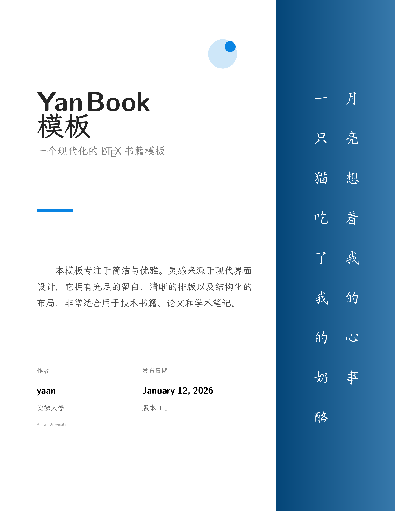
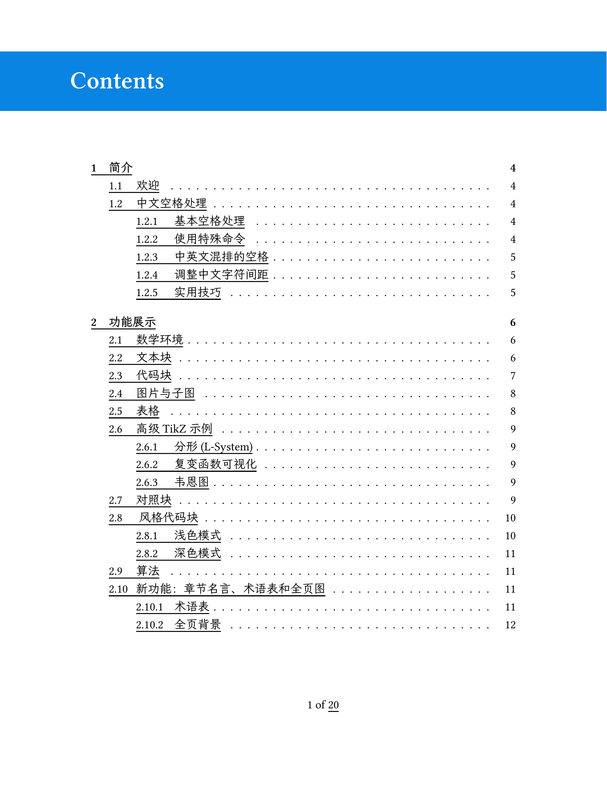
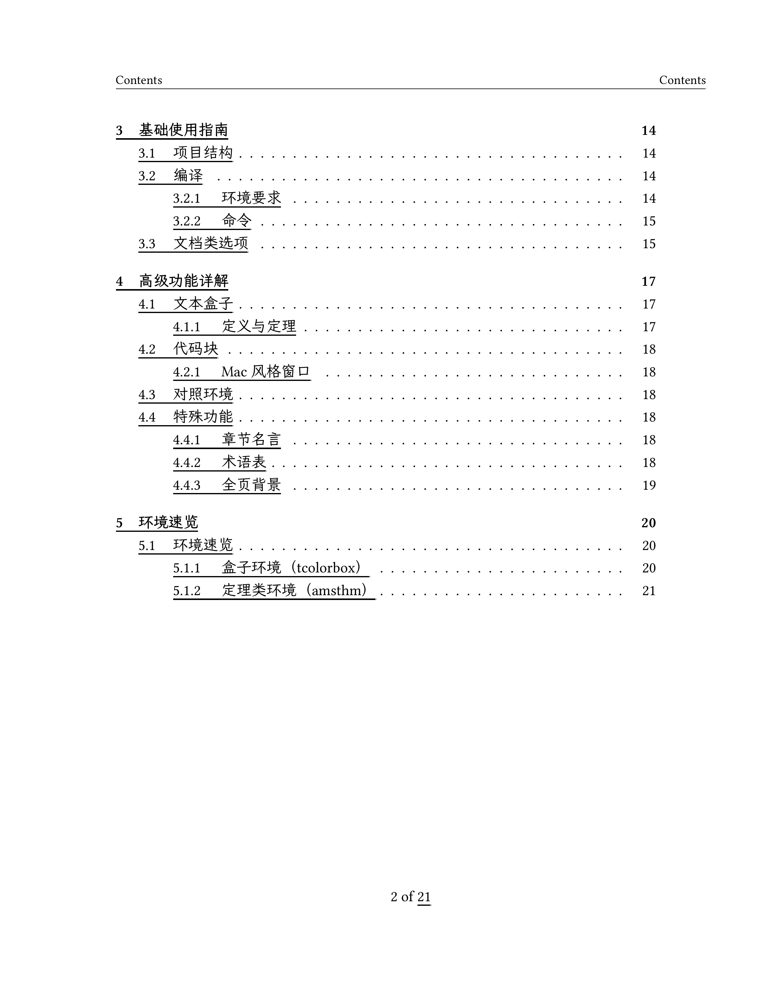
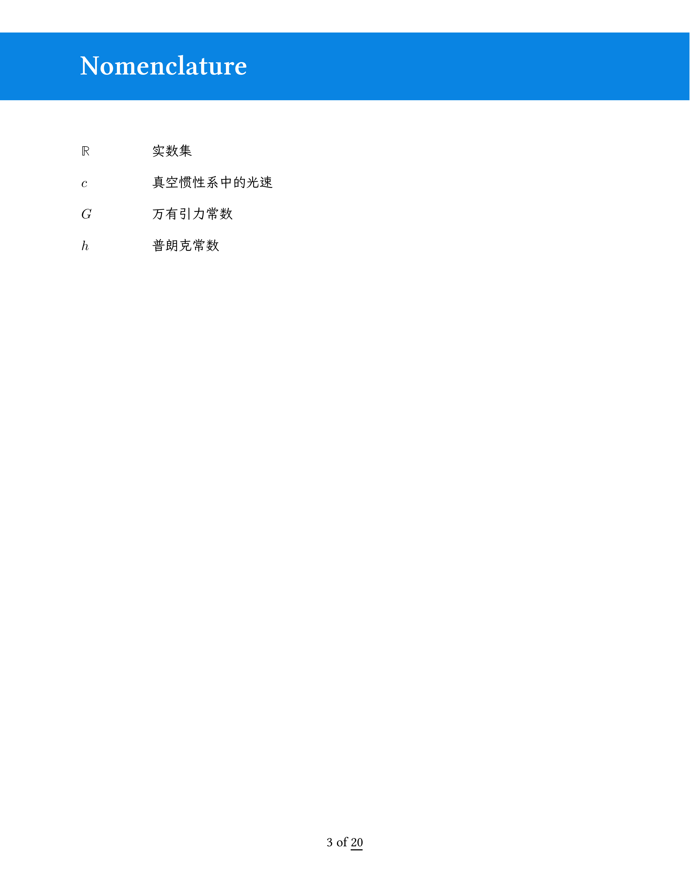
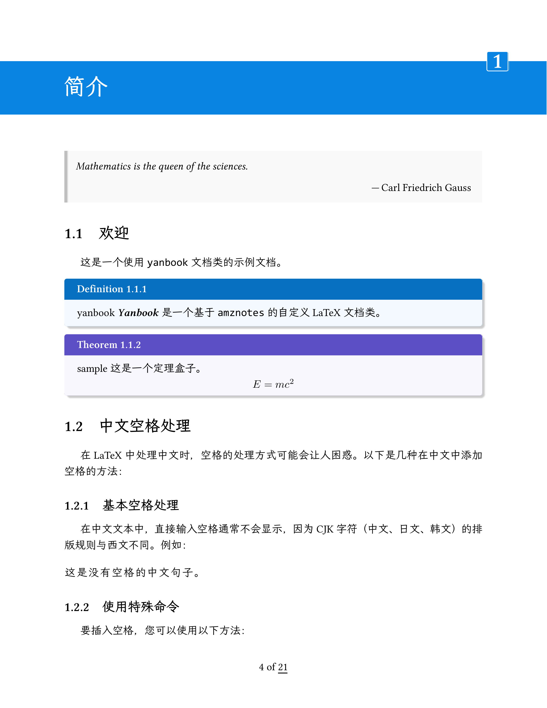
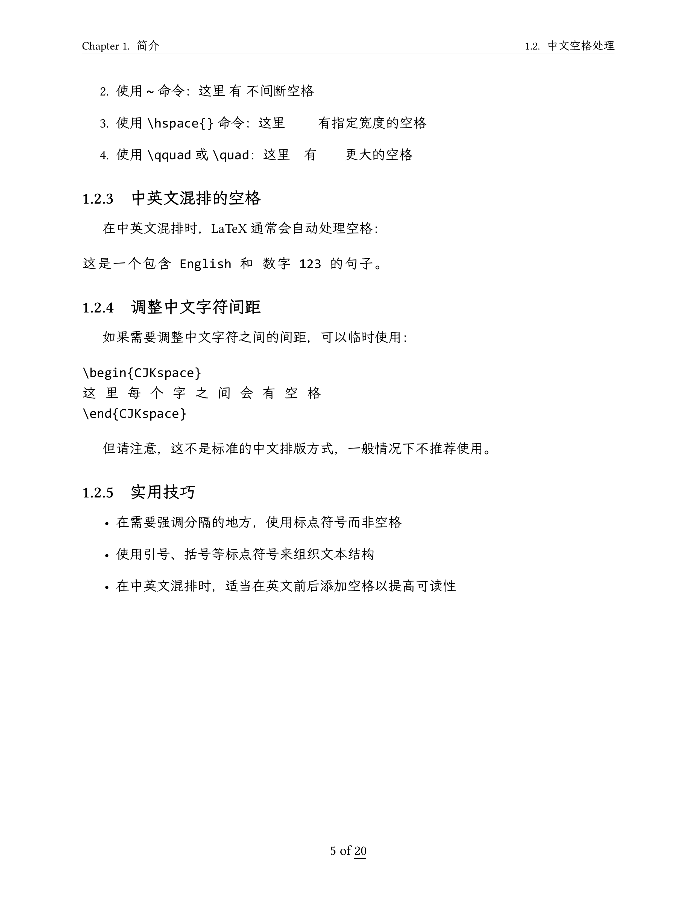
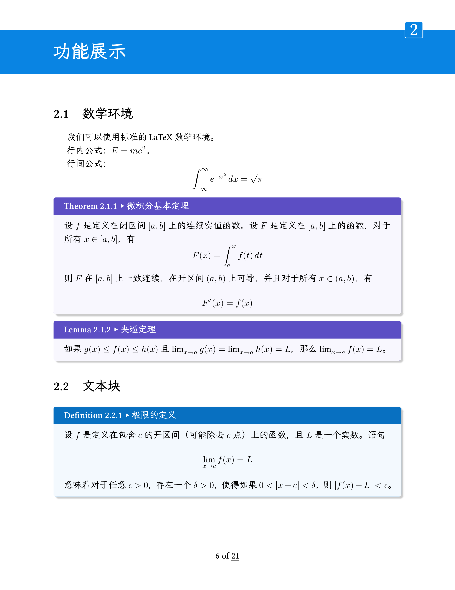
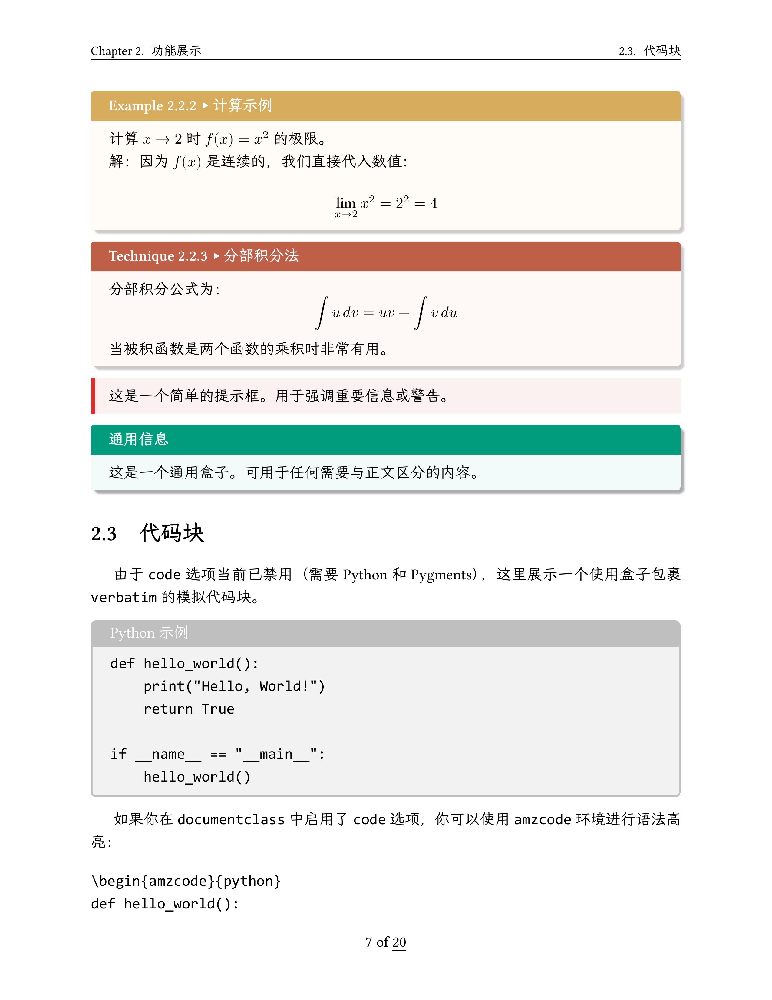
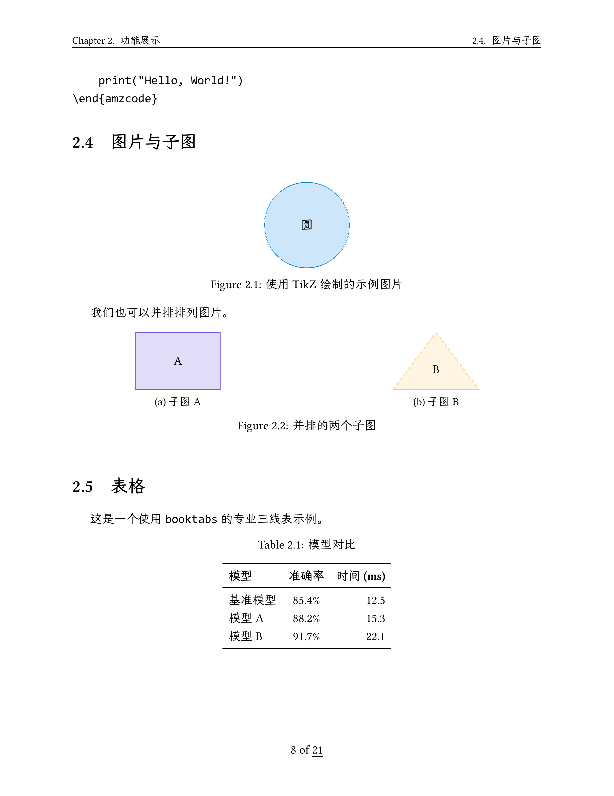
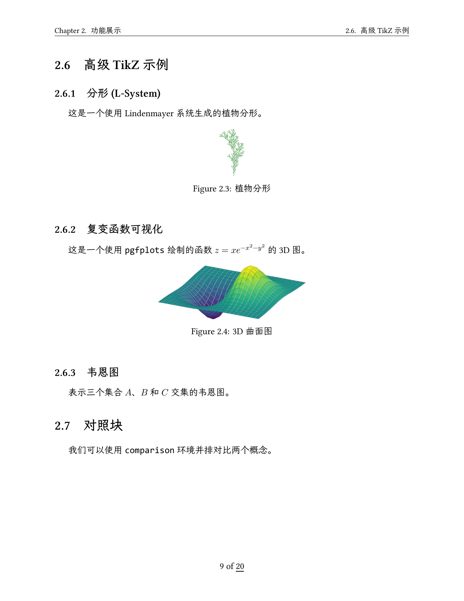
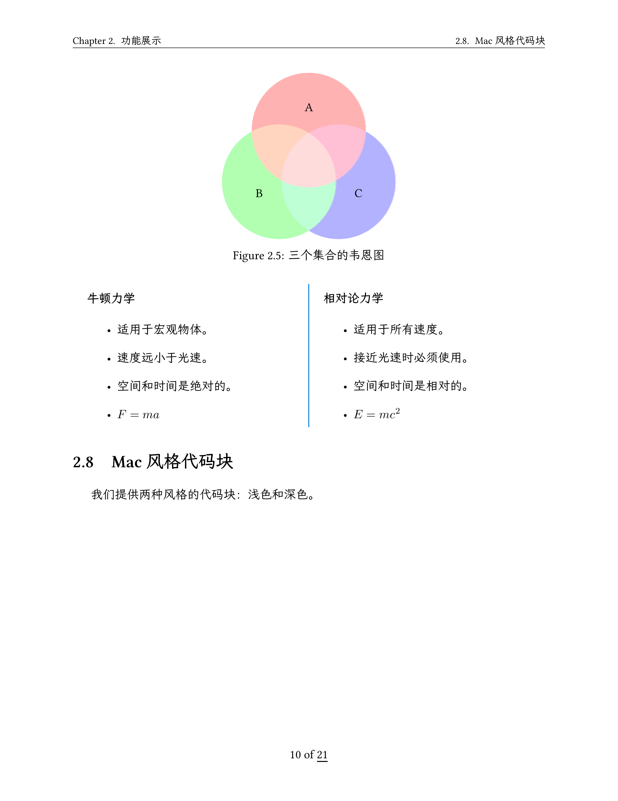
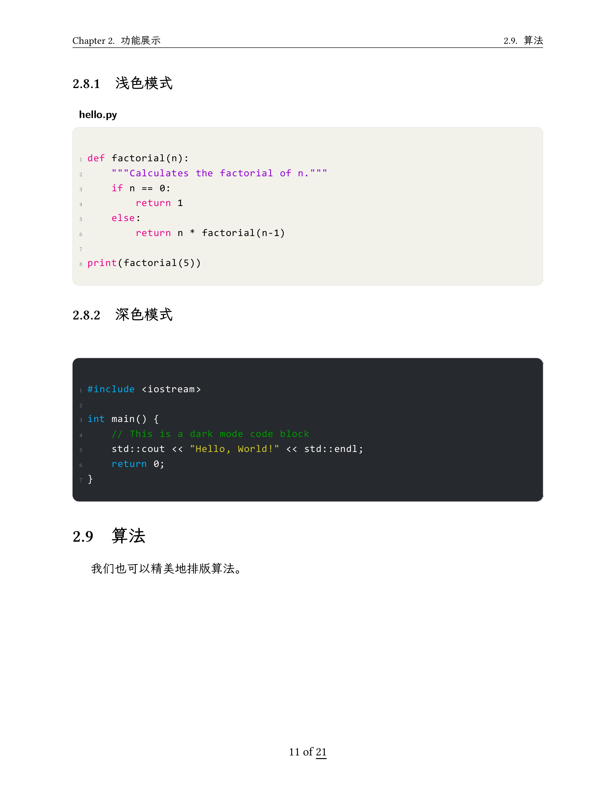
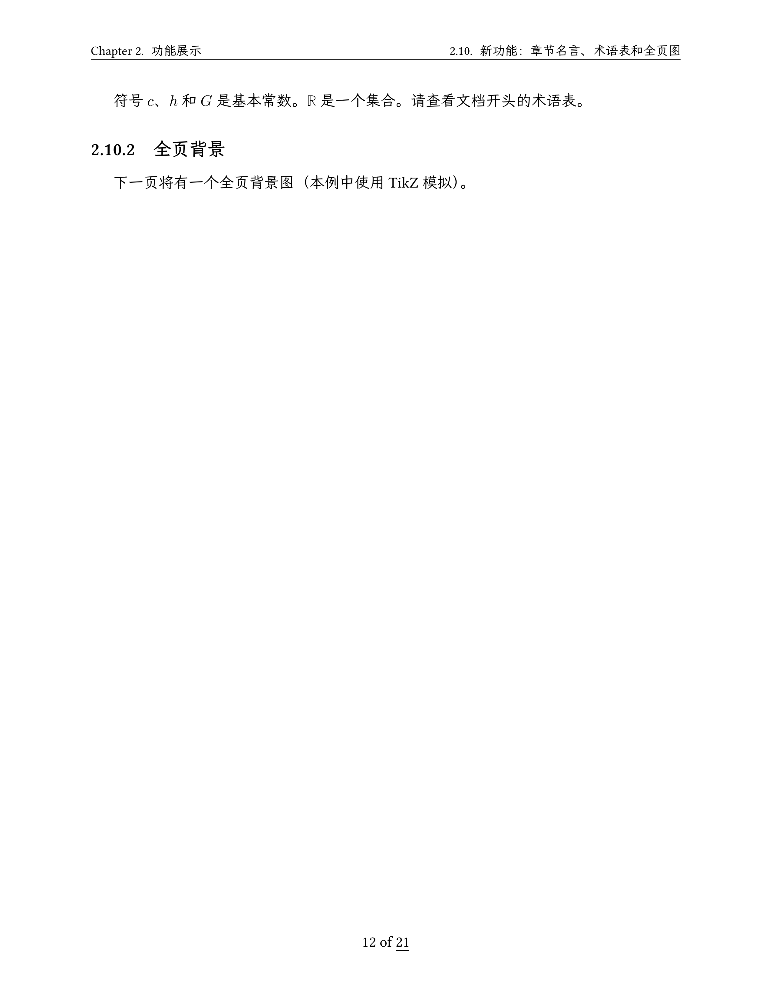