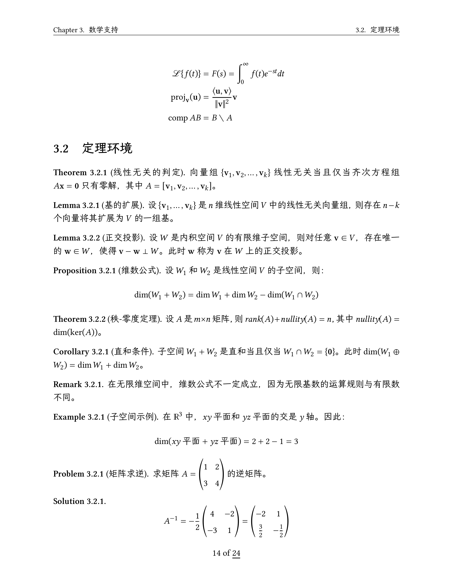
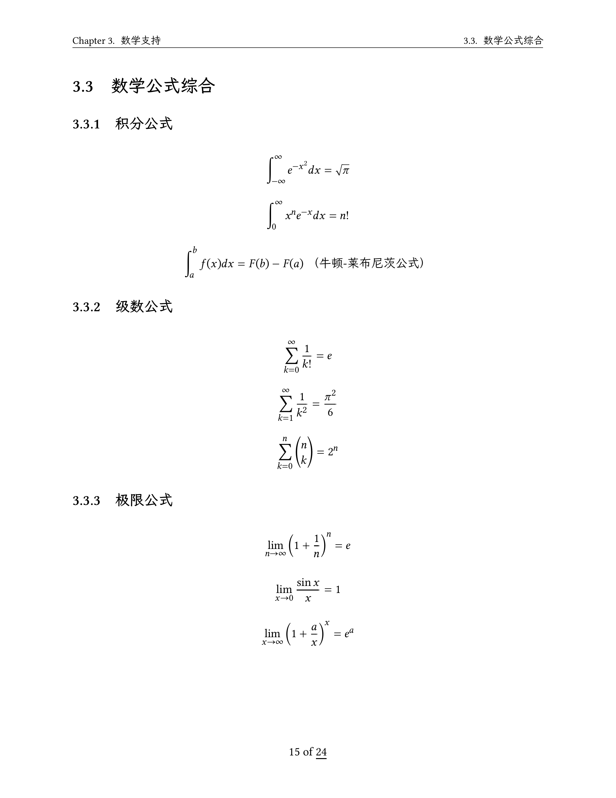
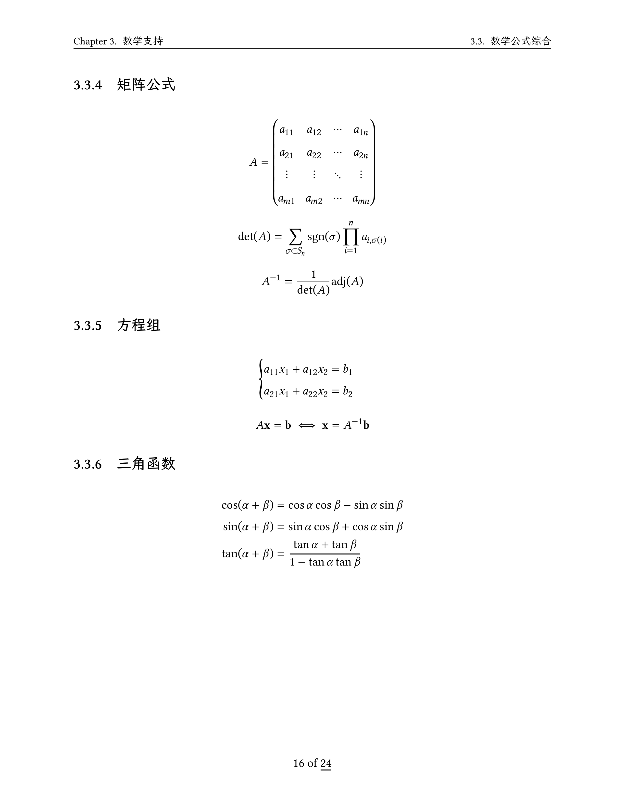
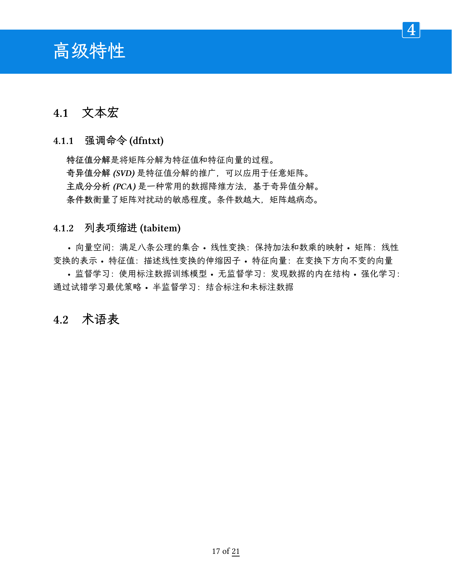
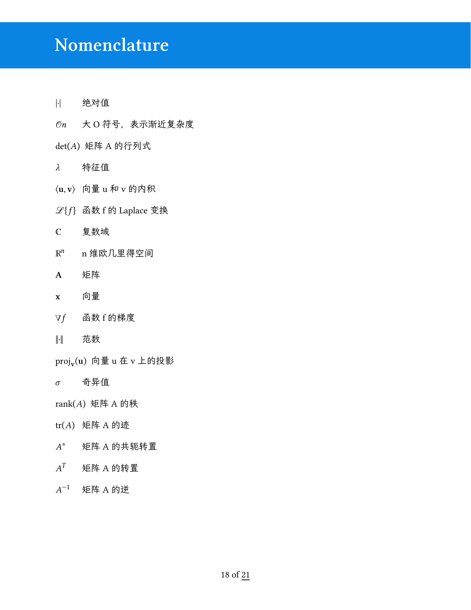
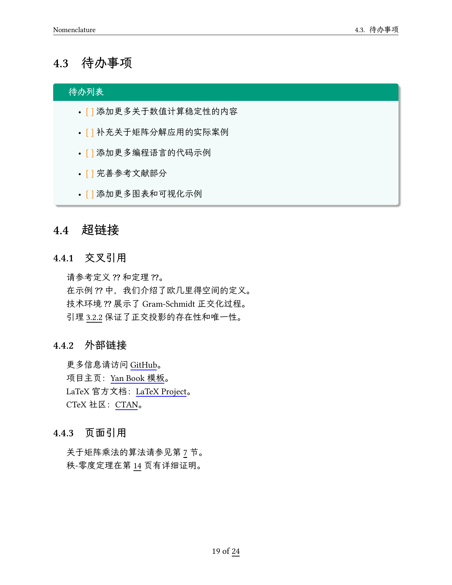
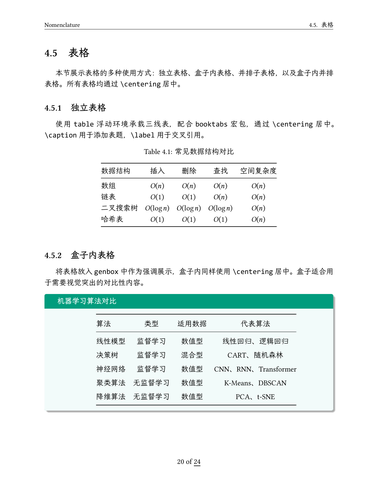
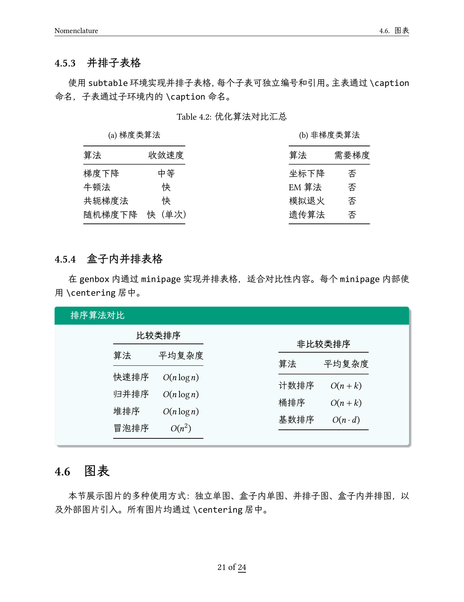
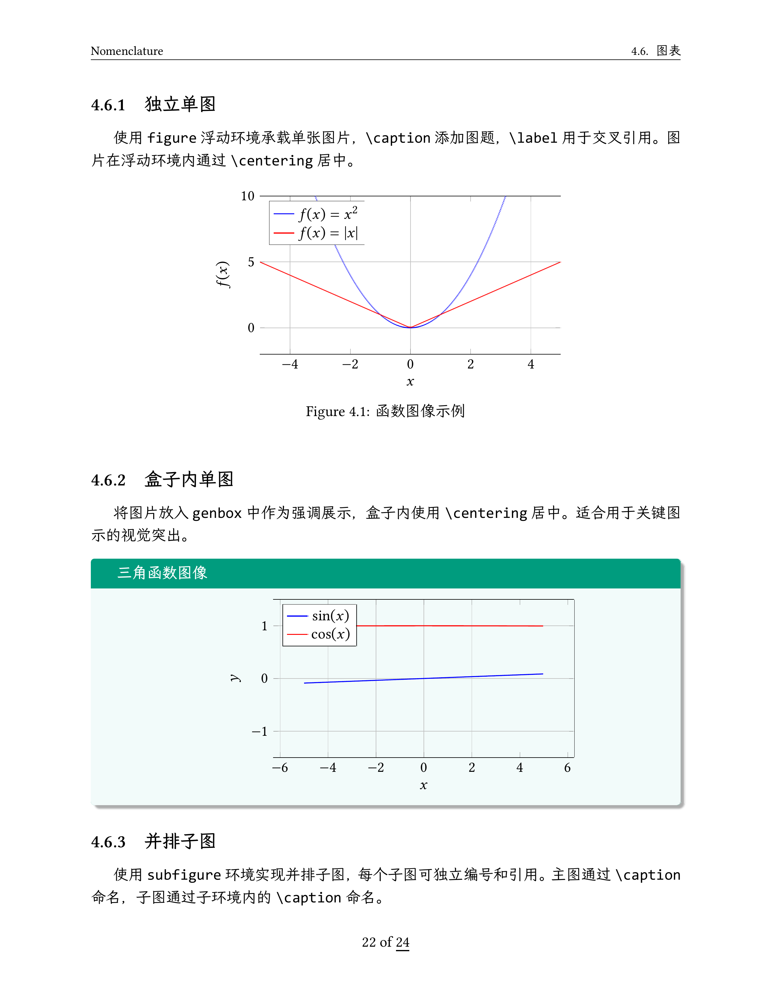
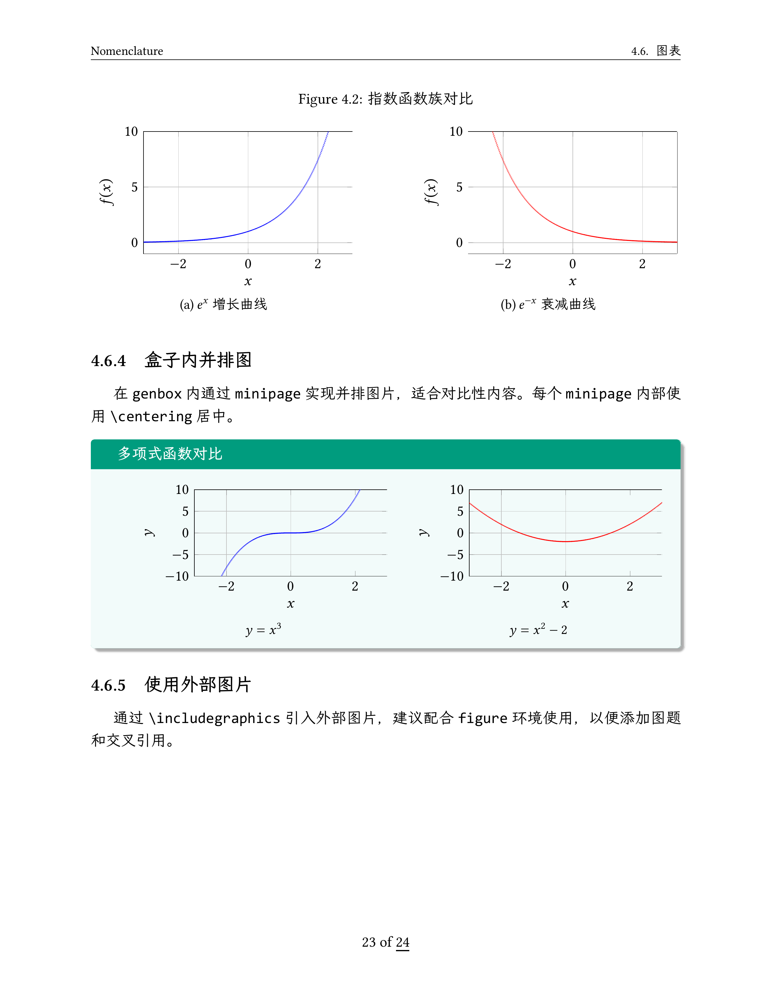

# Yanbook

## 简介

一个现代化的 LaTeX 书籍模板，专为技术文档设计。受 [amznotes](https://github.com/alexmingzhang/latex-notes-template) 风格启发。

中文字体使用 [LXGW WenKai](https://github.com/lxgw/LxgwWenKai)，英文和数学字体使用 [libertinus](https://github.com/alerque/libertinus)，请自行下载并安装。

## 核心特性

| 类别         | 特性                                            |
| ------------ | ----------------------------------------------- |
| **排版**     | 1.5倍行距、首段缩进、美观的章节样式             |
| **字体**     | Libertinus Serif/Math + LXGW WenKai 中文支持    |
| **颜色**     | Flat UI 配色方案，专业的视觉设计                |
| **盒子环境** | dfnbox, exbox, tecbox, genbox, notebox, algobox |
| **代码高亮** | Mac 风格代码块（浅色/深色）、算法盒子           |
| **数学支持** | 丰富的数学宏、定理环境、数学字体                |
| **编译流程** | Makefile 自动化编译，支持 BibTeX                |
| **章节组织** | 三层 Input 架构，实现内容与结构解耦             |

## 使用指南

### 快速开始

```bash
# 完整构建（含 BibTeX）
make build

# 快速编译（不处理 BibTeX）
make xelatex

# 清理临时文件
make clean
```

### SKILL 使用说明

本项目包含详细的使用文档 `yanbook-skills/SKILL.md`，涵盖以下内容：

#### 目录结构

```
project/
├── main.tex                              # 第1层：书籍入口
├── yanbook.cls                           # 模板类文件
├── Makefile                              # 编译脚本
├── contents/
│   └── cover.tex                         # 封面
├── chapters/
│   ├── chapterhead/                      # 第2层：章节头文件集合
│   │   └── chXX_章节名.tex
│   └── chXX_章节名/                      # 第3层：小节文件目录
│       └── secXX_小节名.tex
├── yanbook-skills/
│   └── SKILL.md                          # 完整使用文档
├── assets/                               # 资源文件
└── build/                                # 构建目录
```

#### 三层 Input 架构

本模板采用**三层 Input 结构**，实现内容与结构的完全解耦：

1. **第1层：main.tex** - 书籍入口，管理章节顺序
2. **第2层：chapterhead** - 章节头文件，管理小节顺序
3. **第3层：小节文件** - 具体内容单元

**添加新章节步骤**：

1. 创建章节目录：`chapters/chXX_new_chapter/`
2. 创建小节文件：`chapters/chXX_new_chapter/sec01_xxx.tex`
3. 创建章节头文件：`chapters/chapterhead/chXX_new_chapter.tex`
4. 在 `main.tex` 中添加章节引用

#### 常用环境

- **定义环境**：`dfnbox` - 用于定义和概念
- **示例环境**：`exbox` - 用于示例代码
- **技术环境**：`tecbox` - 用于技术说明
- **定理环境**：`thmbox` - 用于定理和命题
- **引理环境**：`lembox` - 用于引理
- **通用盒子**：`genbox` - 通用内容容器（支持跨页）
- **笔记盒子**：`notebox` - 用于重要笔记
- **算法盒子**：`algobox` - 用于算法展示

#### 代码块

- **Mac 风格浅色**：`maccode[语言]{文件名}`
- **Mac 风格深色**：`macdarkcode[语言]{文件名}`
- **基础代码块**：`lstlisting`

#### 数学支持

启用 `math` 选项后，支持丰富的数学宏和定理环境：

```latex
\documentclass[math]{yanbook}

% 数学宏
\N, \Z, \Q, \R, \C          % 数字集合
\abs{x}, \norm{x}            % 绝对值、范数
\bigO{n}                     % 大O符号

% 定理环境
\begin{theorem} ... \end{theorem}
\begin{lemma} ... \end{lemma}
\begin{corollary} ... \end{corollary}
```

### 完整文档

详细的使用说明请参考 [SKILL.md](yanbook-skills/SKILL.md)，包含：
- 模板概述与快速开始
- 核心环境使用方法
- 代码块样式说明
- 数学支持详解
- 章节组织架构
- 高级特性介绍
- 最佳实践指南

## 预览













